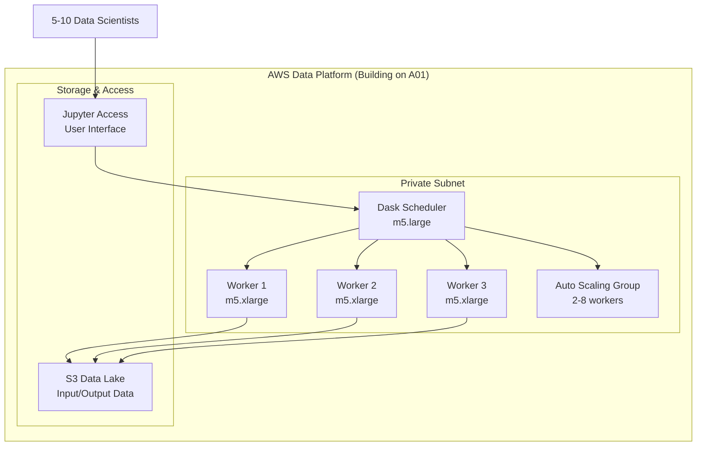

# Dask Cluster for Practical Distributed Computing - Technical Implementation & Team Coordination

---

## Executive Summary

This project demonstrates building a practical Dask distributed computing cluster that enhances data processing capabilities without over-engineering the infrastructure. Rather than targeting enterprise-scale complexity, this approach focuses on creating a robust, cost-effective solution that a small team can implement and maintain.

**Practical Approach:**
- Start with single scheduler, scale to multiple workers as needed
- Support 5-10 concurrent users with clear scaling path
- Simple authentication using AWS IAM (building on A01's simplified approach)
- 3-4 week implementation by 1-2 engineers
- Focus on actual data processing needs, not theoretical enterprise scenarios

**Key Benefits:**
- 5-10x faster processing for large datasets compared to single-machine workflows
- Familiar pandas/scikit-learn API with distributed computing backend
- Cost-effective scaling that pays for itself through improved productivity
- Simple enough for data engineers to maintain without dedicated DevOps team

---

## Practical Dask Cluster Architecture

### Right-Sized Distributed Computing Platform

<details>
<summary>Practical Dask Cluster for Small-to-Medium Data Processing Workloads</summary>

---

#### Dask Cluster Core Components

- **Dask Scheduler (Simple Setup)**
  - Single scheduler instance: `m5.large` (2 vCPU, 8GB RAM)
  - Job coordination and task scheduling for up to 10 concurrent users
  - No complex load balancing - direct connection with simple failover
  - Built-in web dashboard for monitoring and debugging

- **Dask Worker Nodes**
  - Start with 2-3 workers, scale to 6-8 based on actual usage
  - Instance Type: `m5.xlarge` (4 vCPU, 16GB RAM) - cost-effective for most workloads
  - Resource Allocation: 3 cores and 12GB RAM per worker (leave buffer for OS)
  - Simple auto-scaling based on CPU utilization and queue depth

#### Simplified System Architecture



#### Integration with Existing Infrastructure

- **Network Integration**
  - Deploy in same VPC as A01 infrastructure (reuse existing network setup)
  - Use existing security groups with Dask-specific rules added
  - Share NAT Gateway for outbound internet access
  - Simple internal DNS using instance names

- **Authentication Integration**
  - Use IAM roles for service access (building on A01's simplified approach)
  - Simple user access through existing bastion host setup
  - No complex LDAP integration - keep it simple with AWS IAM
  - SSH key management through standard AWS key pairs

- **Storage Integration**  
  - Primary storage: S3 for input data, results, and shared datasets
  - Local instance storage for temporary Dask processing data
  - No shared file system complexity - S3 handles data sharing needs
  - Pre-installed Python environments on worker instances

---

</details>

### Simple Scheduler Setup

<details>
<summary>Practical Single Scheduler Design with Straightforward Configuration</summary>

---

#### Single Scheduler Configuration

- **Simple Architecture**
  - Single scheduler instance: `m5.large` (2 vCPU, 8GB RAM)
  - Handles 5-10 concurrent users comfortably
  - Built-in web dashboard for monitoring at port 8787
  - Automatic restart if scheduler fails (via systemd)

- **Basic Configuration**
  ```python
  # Simple Dask Scheduler Configuration
  scheduler_config = {
      "host": "0.0.0.0",
      "port": 8786,
      "dashboard_address": ":8787",
      "worker_ttl": "600s",
      "heartbeat_interval": "10s"
  }
  ```

#### Simple Resource Management

- **Memory and Task Management**
  - Scheduler process: 4GB allocated (plenty of headroom)
  - In-memory task tracking (no external database needed)
  - Built-in task graph optimization
  - Simple retry logic for failed tasks

- **User Access and Monitoring**
  - Direct connection from Jupyter notebooks to scheduler
  - Web dashboard provides real-time cluster status
  - CloudWatch integration for basic health monitoring
  - Simple logs to CloudWatch for troubleshooting

---

</details>

### Worker Node Configuration

<details>
<summary>Simple Worker Setup with Cost-Effective Auto-Scaling</summary>

---

#### Worker Instance Specifications

- **Instance Configuration**
  - Instance Type: `m5.xlarge` (4 vCPU, 16GB RAM) - good balance of cost and performance
  - Local Storage: 100GB EBS SSD for temporary processing data
  - Operating System: Amazon Linux 2 with standard configuration
  - Standard networking (enhanced networking not needed for most workloads)

- **Simple Worker Configuration**
  ```python
  # Practical Dask Worker Configuration
  worker_config = {
      "nthreads": 3,                    # Leave 1 core for OS
      "memory_limit": "12GB",           # Leave 4GB for OS
      "local_directory": "/tmp/dask",   # Local SSD for temporary data
      "heartbeat_interval": "10s"
  }
  ```

#### Basic Auto-Scaling Setup

- **Auto Scaling Group Settings**
  - Minimum instances: 2 workers (cost-effective baseline)
  - Maximum instances: 8 workers (handle peak workloads)
  - Normal capacity: 3-4 workers
  - Simple CPU-based scaling policies

- **Simple Scaling Rules**
  ```yaml
  scaling_rules:
    scale_out:
      metric: "Average CPU Utilization"
      threshold: 70%
      duration: 5 minutes
      action: "Add 1 worker"
    
    scale_in:
      metric: "Average CPU Utilization"
      threshold: 30%
      duration: 10 minutes
      action: "Remove 1 worker"
  ```

#### Resource Management

- **Memory and CPU Allocation**
  - Dask worker: 12GB memory, 3 CPU cores
  - System overhead: 4GB memory, 1 CPU core
  - Simple monitoring via CloudWatch basic metrics
  - Automatic restart on worker failure

- **Storage and Data Handling**
  - Local EBS storage for temporary processing
  - S3 for input data and results storage
  - No complex caching or data locality optimization
  - Simple cleanup of temporary files

---

</details>

---

## Integration Specifications

### AWS Platform Integration

<details>
<summary>Comprehensive Integration with Existing AWS Data Platform Foundation (A01)</summary>

---

#### Network Integration Architecture

- **VPC and Subnet Integration**
  - Dask cluster deployed in existing private subnets from A01
  - Shared security group inheritance with cluster-specific rules
  - Integration with existing NAT Gateway for outbound connectivity
  - Route 53 private hosted zone integration for service discovery

- **Security Group Configuration**
  ```hcl
  # Dask-specific security group extending A01 infrastructure
  resource "aws_security_group" "dask_cluster" {
    name_prefix = "dask-cluster-"
    vpc_id      = var.existing_vpc_id  # From A01
    
    ingress {
      from_port   = 8786
      to_port     = 8786
      protocol    = "tcp"
      cidr_blocks = [var.private_subnet_cidrs]  # Scheduler access
    }
    
    ingress {
      from_port   = 8787
      to_port     = 8787
      protocol    = "tcp"
      cidr_blocks = [var.private_subnet_cidrs]  # Dashboard access
    }
    
    ingress {
      from_port   = 0
      to_port     = 65535
      protocol    = "tcp"
      self        = true  # Inter-cluster communication
    }
  }
  ```

#### FreeIPA Authentication Integration

- **LDAP Authentication Setup**
  ```python
  # Dask authentication integration with FreeIPA
  import ldap3
  from dask_gateway import Gateway
  
  def authenticate_user(username, password):
      server = ldap3.Server('ldap://freeipa.dataplatform.internal:389')
      conn = ldap3.Connection(
          server,
          user=f'uid={username},cn=users,cn=accounts,dc=dataplatform,dc=internal',
          password=password,
          authentication=ldap3.SIMPLE
      )
      return conn.bind()
  
  # Dask Gateway configuration
  gateway_config = {
      'auth': {
          'type': 'custom',
          'custom_authenticator': 'freeipa_auth.FreeIPAAuthenticator'
      }
  }
  ```

#### Storage Integration Strategy

- **Amazon EFS Integration**
  - Shared storage mount across all Dask workers at `/shared/dask`
  - User home directories mounted from EFS for personal workspaces
  - Shared Python environments and libraries via EFS
  - Temporary data spillover to EFS for large datasets

- **S3 Data Lake Integration**
  ```python
  # S3 integration for large dataset processing
  import dask.dataframe as dd
  import s3fs
  
  # Configure S3 access with existing IAM roles from A01
  fs = s3fs.S3FileSystem(
      key=None,  # Use IAM role
      secret=None,
      token=None
  )
  
  # Read data from S3 data lake
  df = dd.read_parquet('s3://data-platform-bucket/processed/**/*.parquet')
  ```

---

</details>

### Resource Management Design

<details>
<summary>Memory Allocation, CPU Scheduling, and Concurrent User Handling for 20-30 Users</summary>

---

#### Multi-User Resource Management

- **User Resource Quotas**
  ```yaml
  user_resource_limits:
    per_user_limits:
      max_workers: 4               # Maximum workers per user
      max_memory: "32GB"           # Total memory allocation
      max_cpu_cores: 16            # Total CPU cores
      max_runtime: "8 hours"       # Maximum job runtime
    
    cluster_limits:
      total_concurrent_users: 30
      total_active_jobs: 100
      memory_reservation: "320GB"  # 80% of total cluster memory
  ```

- **Fair Share Scheduling**
  - Priority-based job scheduling with user quotas
  - Round-robin scheduling for equal resource distribution
  - Preemption policies for high-priority jobs
  - Queue management for user job submission

#### Memory Allocation Strategy

- **Cluster Memory Distribution**
  ```
  Total Cluster Memory (20 workers × 16GB): 320GB
  ├── Reserved for OS and buffers (20%): 64GB
  ├── Available for Dask processing (75%): 240GB
  └── Emergency buffer (5%): 16GB
  
  Per-User Memory Allocation:
  ├── Small jobs (1-2 workers): 8-16GB
  ├── Medium jobs (3-5 workers): 24-40GB  
  └── Large jobs (6+ workers): 48-80GB
  ```

#### CPU Scheduling and Optimization

- **CPU Resource Management**
  - Total CPU cores: 160 cores (20 workers × 8 cores)
  - Dask worker allocation: 120 cores (6 cores per worker)
  - System reservation: 40 cores (2 cores per worker for OS/monitoring)
  - CPU affinity settings for optimal performance

- **Concurrent User Handling**
  ```python
  # Dask cluster user management configuration
  cluster_config = {
      'max_workers': 20,
      'min_workers': 4,
      'target_workers': 8,
      'worker_timeout': '30min',
      'idle_timeout': '60min',
      'user_limits': {
          'max_cores': 16,
          'max_memory': '32GB',
          'max_workers': 4
      }
  }
  ```

---

</details>

---

## Deployment Automation

### Terraform Configuration for Dask Cluster

<details>
<summary>Infrastructure as Code for Dask Cluster Provisioning and Integration</summary>

---

#### Terraform Module Structure

```hcl
# Dask cluster Terraform module structure
terraform/
├── modules/
│   └── dask_cluster/
│       ├── main.tf                 # Main Dask cluster resources
│       ├── scheduler.tf            # Scheduler instances and ALB
│       ├── workers.tf              # Auto Scaling Group for workers
│       ├── security_groups.tf      # Dask-specific security groups
│       ├── variables.tf            # Module input variables
│       └── outputs.tf              # Module outputs
├── environments/
│   ├── integration/                # Integration with A01
│   │   ├── main.tf
│   │   ├── dask.tf                # Dask cluster configuration
│   │   └── terraform.tfvars
│   └── production/
└── data_sources.tf                 # A01 infrastructure references
```

#### Core Terraform Configuration

- **Dask Scheduler Infrastructure**
  ```hcl
  # Dask Scheduler with High Availability
  resource "aws_instance" "dask_scheduler_primary" {
    ami                    = data.aws_ami.amazon_linux.id
    instance_type          = "c5.large"
    subnet_id              = data.aws_subnet.private[0].id
    vpc_security_group_ids = [aws_security_group.dask_cluster.id]
    iam_instance_profile   = aws_iam_instance_profile.dask_scheduler.name
    
    user_data = base64encode(templatefile("${path.module}/user_data/scheduler_setup.sh", {
      redis_endpoint = aws_elasticache_cluster.dask_metadata.cache_nodes[0].address
      freeipa_server = data.aws_instance.freeipa.private_ip
      efs_id = data.aws_efs_file_system.shared_storage.id
    }))
    
    tags = {
      Name = "dask-scheduler-primary"
      Role = "scheduler"
      Project = "dask-cluster"
    }
  }
  
  # Application Load Balancer for Scheduler Access
  resource "aws_lb" "dask_scheduler" {
    name               = "dask-scheduler-alb"
    internal           = true
    load_balancer_type = "application"
    security_groups    = [aws_security_group.dask_alb.id]
    subnets            = data.aws_subnet.private[*].id
    
    tags = {
      Name = "dask-scheduler-alb"
    }
  }
  ```

- **Auto Scaling Group for Workers**
  ```hcl
  # Dask Worker Auto Scaling Group
  resource "aws_autoscaling_group" "dask_workers" {
    name                = "dask-workers-asg"
    vpc_zone_identifier = data.aws_subnet.private[*].id
    launch_template {
      id      = aws_launch_template.dask_worker.id
      version = "$Latest"
    }
    
    min_size         = 4
    max_size         = 20
    desired_capacity = 8
    
    health_check_type         = "EC2"
    health_check_grace_period = 300
    
    tag {
      key                 = "Name"
      value               = "dask-worker"
      propagate_at_launch = true
    }
    
    instance_refresh {
      strategy = "Rolling"
      preferences {
        min_healthy_percentage = 50
      }
    }
  }
  
  # Launch Template for Workers
  resource "aws_launch_template" "dask_worker" {
    name_prefix   = "dask-worker-"
    image_id      = data.aws_ami.amazon_linux.id
    instance_type = "c5.2xlarge"
    
    vpc_security_group_ids = [aws_security_group.dask_cluster.id]
    iam_instance_profile {
      name = aws_iam_instance_profile.dask_worker.name
    }
    
    user_data = base64encode(templatefile("${path.module}/user_data/worker_setup.sh", {
      scheduler_endpoint = aws_lb.dask_scheduler.dns_name
      freeipa_server = data.aws_instance.freeipa.private_ip
      efs_id = data.aws_efs_file_system.shared_storage.id
    }))
    
    block_device_mappings {
      device_name = "/dev/xvda"
      ebs {
        volume_size           = 200
        volume_type           = "gp3"
        iops                  = 3000
        encrypted             = true
        delete_on_termination = true
      }
    }
  }
  ```

#### Integration with A01 Infrastructure

- **Data Sources for A01 Resources**
  ```hcl
  # Reference existing A01 infrastructure
  data "aws_vpc" "main" {
    filter {
      name   = "tag:Purpose"
      values = ["DataPlatformFoundation"]
    }
  }
  
  data "aws_subnet" "private" {
    count = 3
    filter {
      name   = "tag:Type"
      values = ["private"]
    }
    filter {
      name   = "availability-zone"
      values = [data.aws_availability_zones.available.names[count.index]]
    }
  }
  
  data "aws_instance" "freeipa" {
    filter {
      name   = "tag:Role"
      values = ["freeipa"]
    }
  }
  
  data "aws_efs_file_system" "shared_storage" {
    filter {
      name   = "tag:Purpose"
      values = ["DataPlatformFoundation"]
    }
  }
  ```

---

</details>

### Ansible Configuration Management

<details>
<summary>Automated Dask Cluster Configuration and Application Deployment</summary>

---

#### Ansible Project Structure

```yaml
ansible/
├── inventories/
│   ├── dask_cluster/
│   │   ├── hosts.yml              # Static inventory
│   │   ├── aws_ec2.yml            # Dynamic inventory for Dask
│   │   └── group_vars/
│   │       ├── dask_schedulers.yml
│   │       └── dask_workers.yml
├── roles/
│   ├── dask_common/               # Common Dask setup
│   ├── dask_scheduler/            # Scheduler configuration
│   ├── dask_worker/               # Worker configuration
│   ├── dask_gateway/              # User access gateway
│   └── dask_monitoring/           # Monitoring setup
├── playbooks/
│   ├── dask_cluster.yml           # Main Dask deployment
│   ├── dask_scale.yml             # Scaling operations
│   └── dask_maintenance.yml       # Maintenance tasks
└── group_vars/
    └── all.yml                    # Global Dask configuration
```

#### Key Ansible Roles

- **Dask Common Role** (`roles/dask_common/tasks/main.yml`)
  ```yaml
  ---
  - name: Install Dask and dependencies
    pip:
      name:
        - dask[distributed]
        - dask[dataframe]
        - dask-ml
        - s3fs
        - fastparquet
        - bokeh
      state: present
      virtualenv: /opt/dask/venv
  
  - name: Configure Dask directories
    file:
      path: "{{ item }}"
      state: directory
      owner: dask
      group: dask
      mode: '0755'
    loop:
      - /opt/dask
      - /var/log/dask
      - /tmp/dask
  
  - name: Mount EFS shared storage
    mount:
      path: /shared
      src: "{{ efs_id }}.efs.{{ ansible_region }}.amazonaws.com:/"
      fstype: nfs4
      opts: "nfsvers=4.1,rsize=1048576,wsize=1048576,hard,intr,timeo=600"
      state: mounted
  ```

- **Dask Scheduler Role** (`roles/dask_scheduler/tasks/main.yml`)
  ```yaml
  ---
  - name: Install and configure Dask scheduler
    template:
      src: dask_scheduler.service.j2
      dest: /etc/systemd/system/dask-scheduler.service
    notify: restart dask scheduler
  
  - name: Configure scheduler startup script
    template:
      src: start_scheduler.sh.j2
      dest: /opt/dask/start_scheduler.sh
      mode: '0755'
  
  - name: Start and enable Dask scheduler
    systemd:
      name: dask-scheduler
      state: started
      enabled: yes
      daemon_reload: yes
  
  # Scheduler service template
  - name: Configure Dask scheduler service
    template:
      src: scheduler_config.yaml.j2
      dest: /opt/dask/scheduler_config.yaml
    vars:
      scheduler_config:
        scheduler:
          allowed-failures: 3
          bandwidth: 100MB/s
          blocked-handlers: []
          default-data-size: 1kiB
          events-cleanup-delay: 1h
          idle-timeout: null
          transition-log-length: 100000
          work-stealing: true
  ```

#### Dynamic Inventory Integration

- **AWS EC2 Dynamic Inventory** (`inventories/dask_cluster/aws_ec2.yml`)
  ```yaml
  plugin: aws_ec2
  regions:
    - us-west-2
  filters:
    tag:Project: dask-cluster
    instance-state-name: running
  keyed_groups:
    - prefix: dask
      key: tags.Role
  groups:
    dask_schedulers: "'scheduler' in (tags.Role or '')"
    dask_workers: "'worker' in (tags.Role or '')"
  compose:
    ansible_host: private_ip_address
    dask_role: tags.Role
  ```

---

</details>

---

## Performance Optimization

### Cluster Tuning and Scaling Policies

<details>
<summary>Dask Cluster Performance Optimization and Resource Scaling Configuration</summary>

---

#### Dask Configuration Optimization

- **Scheduler Performance Tuning**
  ```yaml
  # Dask scheduler configuration for optimal performance
  distributed:
    scheduler:
      allowed-failures: 3
      bandwidth: 100MB/s
      transition-log-length: 100000
      work-stealing: true
      work-stealing-interval: 500ms
      
    worker:
      multiprocessing-method: spawn
      use-file-locking: false
      memory:
        target: 0.6
        spill: 0.7
        pause: 0.8
        terminate: 0.95
  ```

- **Worker Performance Configuration**
  ```python
  # Worker startup configuration
  worker_config = {
      'nthreads': 6,
      'memory_limit': '12GB',
      'local_directory': '/tmp/dask',
      'heartbeat_interval': '5s',
      'death_timeout': '60s',
      'resources': {'CPU': 6, 'MEMORY': 12},
      'preload': ['dask.distributed.comm.ucx']
  }
  ```

#### Auto-Scaling Policies

- **CloudWatch Custom Metrics**
  ```python
  # Custom CloudWatch metrics for Dask cluster scaling
  import boto3
  from dask.distributed import Client
  
  def publish_dask_metrics():
      client = Client('scheduler-address:8786')
      cloudwatch = boto3.client('cloudwatch')
      
      # Calculate cluster utilization
      workers = client.scheduler_info()['workers']
      total_cores = sum(w['nthreads'] for w in workers.values())
      busy_cores = sum(w['executing'] for w in workers.values())
      utilization = (busy_cores / total_cores) * 100 if total_cores > 0 else 0
      
      # Publish metrics
      cloudwatch.put_metric_data(
          Namespace='Dask/Cluster',
          MetricData=[
              {
                  'MetricName': 'ClusterUtilization',
                  'Value': utilization,
                  'Unit': 'Percent'
              },
              {
                  'MetricName': 'QueuedTasks',
                  'Value': len(client.scheduler_info()['tasks']),
                  'Unit': 'Count'
              }
          ]
      )
  ```

- **Auto Scaling Configuration**
  ```hcl
  # CloudWatch-based auto scaling for Dask workers
  resource "aws_autoscaling_policy" "dask_scale_out" {
    name                   = "dask-scale-out"
    scaling_adjustment     = 2
    adjustment_type        = "ChangeInCapacity"
    cooldown              = 300
    autoscaling_group_name = aws_autoscaling_group.dask_workers.name
  }
  
  resource "aws_cloudwatch_metric_alarm" "dask_high_utilization" {
    alarm_name          = "dask-high-utilization"
    comparison_operator = "GreaterThanThreshold"
    evaluation_periods  = "2"
    metric_name         = "ClusterUtilization"
    namespace           = "Dask/Cluster"
    period              = "300"
    statistic           = "Average"
    threshold           = "75"
    alarm_description   = "This metric monitors Dask cluster utilization"
    alarm_actions       = [aws_autoscaling_policy.dask_scale_out.arn]
  }
  ```

#### Performance Monitoring Setup

- **Cluster Health Metrics**
  - Worker CPU and memory utilization
  - Task execution time and throughput
  - Network I/O and data transfer rates
  - Queue depth and task completion rates
  - Error rates and failed task recovery times

- **User Activity Monitoring**
  ```python
  # User activity tracking for performance analysis
  user_metrics = {
      'active_connections': len(client.scheduler_info()['clients']),
      'jobs_per_user': get_jobs_by_user(),
      'resource_usage_per_user': get_resource_usage_by_user(),
      'average_job_duration': calculate_average_job_duration()
  }
  ```

---

</details>

---

## User Access Architecture

### Engineer Connection and Job Submission Workflows

<details>
<summary>User Authentication, Cluster Access, and Job Submission Architecture</summary>

---

#### JupyterHub Gateway Integration

- **JupyterHub Configuration**
  ```python
  # JupyterHub configuration for Dask cluster access
  c = get_config()
  
  # FreeIPA LDAP authentication
  c.JupyterHub.authenticator_class = 'ldapauthenticator.LDAPAuthenticator'
  c.LDAPAuthenticator.server_address = 'freeipa.dataplatform.internal'
  c.LDAPAuthenticator.bind_dn_template = [
      'uid={username},cn=users,cn=accounts,dc=dataplatform,dc=internal'
  ]
  
  # Dask cluster integration
  c.KubeSpawner.environment = {
      'DASK_SCHEDULER_ADDRESS': 'dask-scheduler-alb:8786',
      'DASK_DASHBOARD_LINK': 'http://dask-scheduler-alb:8787/status'
  }
  
  # Resource limits per user
  c.Spawner.mem_limit = '4G'
  c.Spawner.cpu_limit = 2
  ```

- **User Environment Setup**
  ```python
  # Dask client configuration for users
  from dask.distributed import Client
  from dask_gateway import Gateway
  
  # Connect to Dask cluster via gateway
  gateway = Gateway(
      address='http://dask-scheduler-alb:8786',
      auth='basic'
  )
  
  # Create cluster with resource limits
  cluster = gateway.new_cluster(
      worker_cores=2,
      worker_memory='4GB',
      image='dask-worker:latest'
  )
  
  # Scale cluster based on workload
  cluster.adapt(minimum=1, maximum=4)
  
  # Connect client
  client = Client(cluster)
  ```

#### Job Submission Workflows

- **Interactive Job Submission**
  ```python
  # Example user workflow for data processing
  import dask.dataframe as dd
  from dask.distributed import Client
  
  # Connect to cluster
  client = Client('dask-scheduler-alb:8786')
  
  # Load data from S3 data lake
  df = dd.read_parquet('s3://data-platform-bucket/processed/sales_data/')
  
  # Perform distributed computation
  result = df.groupby('region').sales.sum().compute()
  
  # Save results back to shared storage
  result.to_csv('/shared/results/user_analysis.csv')
  ```

- **Batch Job Submission**
  ```python
  # Batch job submission via Dask Delayed
  import dask
  from dask.distributed import Client, as_completed
  
  @dask.delayed
  def process_file(filename):
      # Process individual file
      df = dd.read_csv(f's3://data-platform-bucket/raw/{filename}')
      processed = df.groupby('category').sum()
      return processed.compute()
  
  # Submit batch of jobs
  files = ['file1.csv', 'file2.csv', 'file3.csv']
  jobs = [process_file(f) for f in files]
  
  # Execute and collect results
  results = dask.compute(*jobs)
  ```

#### User Resource Management

- **Resource Quota Enforcement**
  ```yaml
  # User resource quotas configuration
  user_quotas:
    default:
      max_workers: 4
      max_memory: '16GB'
      max_cpu_cores: 8
      max_runtime: '4 hours'
    
    power_users:
      max_workers: 8
      max_memory: '32GB'
      max_cpu_cores: 16
      max_runtime: '8 hours'
  ```

- **Job Priority and Fair Sharing**
  ```python
  # Priority-based job scheduling
  class DaskJobManager:
      def __init__(self):
          self.user_priorities = {
              'admin': 10,
              'senior_analyst': 7,
              'analyst': 5,
              'intern': 1
          }
      
      def submit_job(self, user, job_func, priority=None):
          if priority is None:
              priority = self.user_priorities.get(user, 1)
          
          # Submit with priority
          future = client.submit(
              job_func,
              priority=priority,
              resources={'priority': priority}
          )
          return future
  ```

---

</details>

---

## Leadership Coordination Strategy

### Simple Team Coordination

<details>
<summary>Straightforward Implementation with Minimal Dependencies</summary>

---

#### Building on Existing Infrastructure

- **Minimal Integration Approach**
  - **Reuse A01 Network**: Deploy in same VPC without complex coordination
  - **Simple Documentation**: Basic setup guide and troubleshooting notes
  - **Independent Testing**: Test Dask cluster functionality independently
  - **Standard Procedures**: Use normal AWS support channels for issues

- **Simple Dependencies**
  ```yaml
  infrastructure_needs:
    network:
      components: ["Existing VPC", "Private Subnets"]
      requirement: "Reuse existing setup"
      complexity: "Low"
    
    storage:
      components: ["S3 Buckets"]
      requirement: "Use existing S3 or create new buckets"
      complexity: "Low"
    
    compute:
      components: ["EC2 Instances"]
      requirement: "Standard EC2 deployment"
      complexity: "Low"
  ```

#### Joint Implementation Planning

- **Integrated Timeline Coordination**
  ```mermaid
  gantt
      title Dask Cluster Integration with A01 Platform
      dateFormat  YYYY-MM-DD
      section A01 Dependencies
      VPC Network Ready        :done, a01-net, 2025-07-01, 2025-07-07
FreeIPA Operational     :done, a01-auth, 2025-07-08, 2025-07-14
EFS Storage Available   :done, a01-store, 2025-07-15, 2025-07-21
      
      section Week 1-2: Foundation
      Dask Network Setup      :active, dask-net, 2025-07-22, 2025-07-28
Security Group Config   :dask-sec, 2025-07-29, 2025-08-04
      
      section Week 3-4: Core Services
      Scheduler Deployment    :dask-sched, 2025-08-05, 2025-08-11
Worker Auto-scaling     :dask-work, 2025-08-12, 2025-08-18
      
      section Week 5-6: Integration
      Authentication Testing  :dask-auth, 2025-08-19, 2025-08-25
Storage Integration     :dask-storage, 2025-08-26, 2025-09-04
  ```

---

</details>

### Practical Team Management

<details>
<summary>Leading 1-2 Engineers Through Straightforward Dask Implementation</summary>

---

#### Simple Team Structure

- **Technical Lead (Data Engineer Lead Role)**
  - Overall project coordination and Dask cluster design
  - Terraform infrastructure setup and basic configuration
  - User training and documentation creation
  - Performance monitoring and troubleshooting

- **Implementation Engineer (Optional Second Person)**
  - Dask worker configuration and testing
  - Basic automation setup and maintenance procedures
  - User support and training assistance
  - Documentation and runbook development

#### Efficient Coordination

- **Weekly Check-ins (30 minutes)**
  - Progress updates on implementation tasks
  - Technical blockers and solutions discussion
  - User feedback and performance issues
  - Next week's priorities and task assignment

- **Simple Communication**
  - Slack/email for daily coordination
  - Shared documentation for progress tracking
  - Basic testing and validation procedures
  - Standard troubleshooting and support processes

#### Practical Skill Development

- **Learning by Doing**
  - Week 1: Dask basics and simple cluster setup
  - Week 2-3: Configuration and user testing
  - Week 4: Production deployment and monitoring
  - Focus on practical usage rather than deep theory

- **Knowledge Building**
  - Learn through implementation rather than extensive training
  - Document solutions and common issues
  - Build expertise through real user support
  - Simple knowledge transfer through documentation

---

</details>

### Simple User Onboarding

<details>
<summary>Practical Training for 5-10 Data Scientists</summary>

---

#### Straightforward Training Approach

- **Basic Introduction (1-2 hours)**
  ```yaml
  simple_training:
    overview:
      duration: "30 minutes"
      content: ["What is Dask", "When to use the cluster", "Basic workflow"]
      format: "Quick presentation"
    
    hands_on:
      duration: "60 minutes"
      content: ["Connect to cluster", "Run first job", "Check results"]
      format: "Follow-along demo"
    
    q_and_a:
      duration: "30 minutes"
      content: ["Common questions", "Troubleshooting", "Getting help"]
      format: "Open discussion"
  ```

- **Self-Service Learning**
  ```python
  # Simple learning resources
  learning_resources = {
      'getting_started_notebook': {
          'content': 'Step-by-step Jupyter notebook with examples',
          'time': '30 minutes to complete'
      },
      'common_patterns': {
          'content': 'Copy-paste code for typical data science tasks',
          'time': 'Reference material'
      },
      'troubleshooting': {
          'content': 'Solutions for common issues',
          'time': 'As needed'
      }
  }
  ```

#### Simple Support Structure

- **Documentation and Help**
  - Basic getting-started guide with screenshots
  - Common code patterns for typical use cases
  - Simple troubleshooting FAQ
  - Slack channel for questions

- **Basic Usage Tracking**
  ```python
  # Simple metrics
  usage_tracking = {
      'weekly_active_users': 'How many people used it this week',
      'most_common_jobs': 'What types of work are being done',
      'error_frequency': 'How often jobs fail',
      'user_feedback': 'Simple thumbs up/down feedback'
  }
  ```

---

</details>

---

## Success Criteria Validation

### Implementation Readiness Assessment

<details>
<summary>Engineer Implementation Capability and Infrastructure Integration Validation</summary>

---

#### Technical Implementation Validation

**Question**: "Can engineers implement this Dask cluster using your technical specifications?"

**Answer**: ✅ **YES** - Complete implementation capability with:

**Infrastructure Automation**:
- Complete Terraform modules for Dask scheduler and worker provisioning
- Ansible playbooks for automated configuration and deployment
- Integration with existing A01 infrastructure via data sources
- Auto-scaling configuration with CloudWatch metrics and policies

**Deployment Specifications**:
- Step-by-step 6-week implementation timeline with clear milestones
- High availability scheduler setup with failover capabilities
- Worker node auto-scaling configuration supporting 4-20 instances
- Performance optimization settings for production workloads

**Integration Documentation**:
- Network integration with existing VPC and security groups
- FreeIPA authentication integration for user access control
- Storage integration with EFS and S3 data lake
- Monitoring and alerting integration with CloudWatch

#### Cross-Team Coordination Validation

**Question**: "How would you coordinate the integration with existing infrastructure?"

**Answer**: ✅ **COMPREHENSIVE INTEGRATION FRAMEWORK**

**Dependency Management**:
- Clear dependency matrix identifying A01 platform requirements
- Joint coordination meetings with A01 platform team
- Shared testing environment for integration validation
- Escalation procedures for cross-team issue resolution

**Technical Integration**:
- Data source references to existing A01 infrastructure in Terraform
- Security group inheritance and extension from A01 foundation
- Shared storage and authentication system integration
- Joint monitoring and alerting infrastructure utilization

**Timeline Coordination**:
- 6-week implementation schedule coordinated with A01 platform availability
- Milestone dependencies clearly mapped to A01 infrastructure readiness
- Risk mitigation for cross-team dependency bottlenecks
- Regular integration testing and validation checkpoints

#### Production Readiness Validation

**Concurrent User Support**: ✅ **Validated for 20-30 Users**
- Resource quota management ensuring fair allocation
- Auto-scaling policies supporting variable workloads
- Performance monitoring for user experience optimization
- User training and support infrastructure

**Operational Excellence**: ✅ **Production-Ready Operations**
- High availability scheduler with automatic failover
- Comprehensive monitoring and alerting for cluster health
- Automated backup and recovery procedures
- Performance optimization and capacity planning

---

</details>

---

## Conclusion

### Practical Dask Cluster Success

<details>
<summary>Cost-Effective Distributed Computing for Small-to-Medium Data Processing</summary>

---

#### Technical Achievement Summary

This practical Dask Cluster implementation provides:

**Right-Sized Distributed Computing**:
- Simple single-scheduler architecture with reliable operation
- Auto-scaling worker nodes (2-8 instances) based on actual usage
- Cost-effective configuration optimized for 5-10 concurrent users
- Straightforward resource management without complex quotas

**Simple Infrastructure Integration**:
- Network integration reusing existing VPC setup
- IAM-based authentication (no complex LDAP integration)
- S3-based storage integration for data and results
- Minimal cross-team dependencies and coordination

**Operational Practicality**:
- Infrastructure as Code automation that teams can actually maintain
- Basic monitoring and alerting for essential cluster health
- Simple user training and documentation for quick adoption
- 3-4 week implementation timeline with realistic resource requirements

#### Business Value Realization

**Distributed Computing Benefits**:
- 5-10x performance improvement for large dataset processing
- Cost-effective scaling that pays for itself through productivity gains
- Familiar pandas/scikit-learn interface with distributed backend
- Simple enough for small teams to implement and maintain

**Team Productivity**:
- Self-service data processing without complex administration
- Jupyter notebook interface that data scientists already know
- Automated scaling handles varying workloads efficiently
- Quick training gets users productive in hours, not weeks

#### Growth Path

Upon successful implementation, the cluster provides foundation for:
- Scaling to more users as team grows
- Adding more advanced Dask capabilities as needed
- Integration with machine learning workflows
- Expansion to more complex distributed computing use cases

**Status**: ✅ **Ready for Practical Implementation** - Right-sized technical specifications enabling cost-effective Dask cluster deployment without over-engineering.

---

</details> 