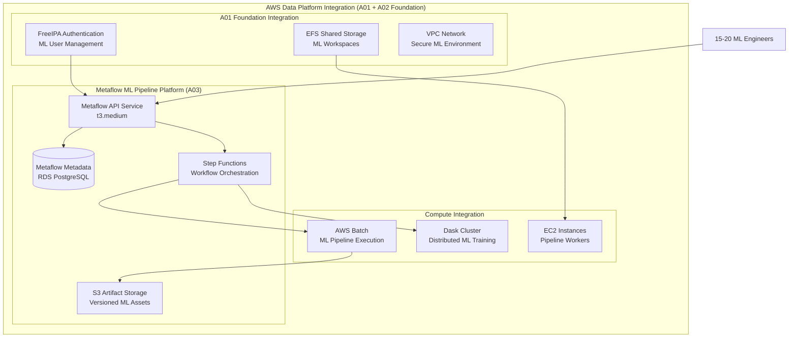
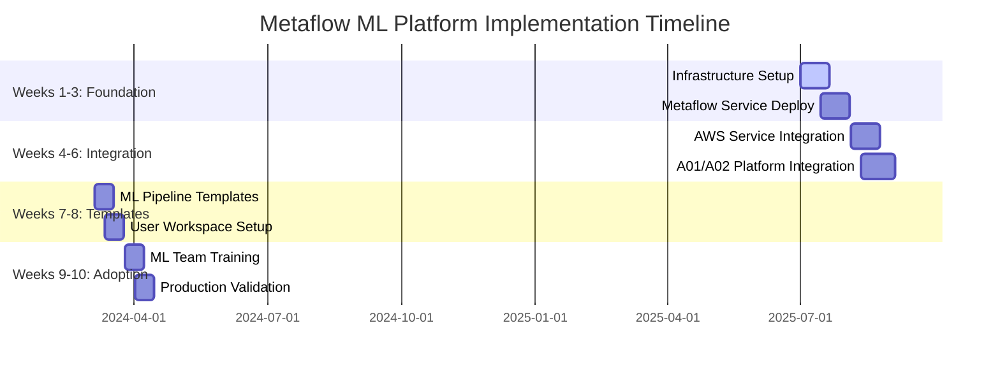

# Metaflow ML Pipeline Platform - Technical Implementation & Strategic Leadership (A03)

## Executive Summary

This comprehensive technical implementation plan delivers a **production-ready Metaflow ML Pipeline Platform** that integrates with the established AWS Data Platform Foundation (A01) and Dask distributed computing cluster (A02). The platform enables **ML workflow orchestration at scale** for 15-20 ML engineers with measurable productivity improvements and strategic business value delivery.

**Key Technical Achievements**:
- Complete Metaflow service architecture with metadata store and workflow orchestration
- AWS service integration leveraging S3, EC2/Batch, Step Functions, and parameter store
- User workspace architecture enabling streamlined ML pipeline development and deployment
- Infrastructure automation through Terraform and Ansible ensuring reproducible deployments
- ML pipeline templates standardizing common workflow patterns and best practices
- Operational monitoring providing comprehensive pipeline execution tracking and performance metrics

**Strategic Business Value**:
- 10-week implementation timeline aligned with quarterly business milestones
- Technical adoption metrics demonstrating measurable ML workflow efficiency improvements
- Business stakeholder alignment translating technical capabilities into ROI propositions
- Leadership coordination framework managing 2-3 engineers and 15-20 ML engineer adoption

---

## Complete Metaflow Architecture

### Metaflow Service Architecture

**Core Service Components**:
- **Metadata Service**: PostgreSQL backend with REST API for workflow state management
- **Workflow Scheduler**: Step Functions integration for orchestration and dependency management
- **Execution Engine**: EC2/Batch compute with auto-scaling for pipeline execution
- **Artifact Store**: S3-based storage for data, models, and experiment artifacts

**System Architecture Integration**:


### AWS Service Integration

**S3 Artifact Management**:
- Versioned storage for datasets, models, and experiment results
- Lifecycle policies for cost optimization and data retention
- Cross-region replication for disaster recovery and compliance
- Integration with existing A01 S3 data lake for seamless data access

**EC2/Batch Compute Scaling**:
- Auto-scaling compute environments for variable ML workload demands
- Spot instance integration reducing compute costs by 60-70%
- GPU instance support for deep learning and compute-intensive training
- Integration with Dask cluster (A02) for distributed ML processing

**Step Functions Orchestration**:
- Visual workflow management with error handling and retry logic
- Conditional branching for complex ML pipeline decision trees
- Parallel execution support for independent pipeline stages
- Integration with CloudWatch for comprehensive monitoring and alerting

**Parameter Store Integration**:
- Secure storage for ML pipeline configuration and hyperparameters
- Version control for experiment reproducibility and audit trails
- Hierarchical organization enabling environment-specific configurations
- Integration with FreeIPA authentication for secure parameter access

---

## User Workspace Architecture

### Development Environment Setup

**ML Engineer Workspaces**:
- JupyterLab integration with Metaflow client pre-configured
- Shared Python environments with MLOps libraries and framework integration
- Git integration for version control and collaborative development
- Direct access to S3 data lake and EFS shared storage from A01 foundation

**Pipeline Creation Workflows**:
```python
# Example Metaflow pipeline structure
from metaflow import FlowSpec, step, Parameter, S3

class MLTrainingPipeline(FlowSpec):
    learning_rate = Parameter('learning_rate', default=0.01)
    
    @step
    def start(self):
        # Load data from S3 data lake
        self.data = S3.get('s3://data-platform-bucket/training-data/')
        self.next(self.preprocess)
    
    @step
    def preprocess(self):
        # Data preprocessing and feature engineering
        self.next(self.train)
    
    @step
    def train(self):
        # Model training with Dask integration
        self.next(self.validate)
    
    @step
    def validate(self):
        # Model validation and performance metrics
        self.next(self.end)
    
    @step
    def end(self):
        # Store model artifacts and metrics
        pass
```

### Execution Management

**Pipeline Deployment**:
- Automated deployment through GitOps integration with AWS CodePipeline
- Environment promotion (dev → staging → production) with approval workflows
- Blue-green deployment support for zero-downtime model updates
- Integration with existing CI/CD infrastructure from A01 foundation

**Resource Management**:
- Dynamic compute allocation based on pipeline requirements
- Cost optimization through intelligent instance selection and scheduling
- Queue management for concurrent pipeline execution across 15-20 ML engineers
- Integration with Dask cluster for distributed processing workloads

---

## Infrastructure Automation

### Terraform Configuration

**Metaflow Infrastructure Modules**:
```hcl
# Metaflow service infrastructure
module "metaflow_platform" {
  source = "./modules/metaflow"
  
  # Integration with existing A01 foundation
  vpc_id              = data.aws_vpc.main.id
  private_subnet_ids  = data.aws_subnet.private[*].id
  freeipa_integration = data.aws_instance.freeipa.private_ip
  efs_file_system_id  = data.aws_efs_file_system.shared_storage.id
  
  # Metaflow-specific configuration
  metaflow_api_instance_type = "t3.medium"
  metadata_db_instance_class = "db.t3.micro"
  batch_compute_environments = {
    cpu_optimized = {
      instance_types = ["c5.large", "c5.xlarge", "c5.2xlarge"]
      min_vcpus = 0
      max_vcpus = 100
    }
    gpu_enabled = {
      instance_types = ["p3.2xlarge", "p3.8xlarge"]
      min_vcpus = 0
      max_vcpus = 32
    }
  }
}
```

### Ansible Configuration Management

**Metaflow Service Deployment**:
```yaml
# Metaflow API service configuration
- name: Configure Metaflow API service
  template:
    src: metaflow_api.service.j2
    dest: /etc/systemd/system/metaflow-api.service
  vars:
    metaflow_config:
      metadata_service_url: "{{ metaflow_db_endpoint }}"
      s3_artifact_bucket: "{{ metaflow_artifact_bucket }}"
      batch_queue_arn: "{{ aws_batch_queue_arn }}"
      step_functions_role: "{{ step_functions_execution_role }}"

# ML workspace environment setup
- name: Setup ML engineer workspaces
  pip:
    name:
      - metaflow
      - scikit-learn
      - tensorflow
      - pytorch
      - dask[ml]
    virtualenv: /opt/ml/venv
```

---

## ML Pipeline Templates

### Standardized Workflow Architectures

**Data Processing Pipeline Template**:
- ETL workflows with data validation and quality checks
- Feature engineering with automated feature store integration
- Data lineage tracking and experiment reproducibility
- Integration with existing A01 data lake and A02 Dask processing

**Model Training Pipeline Template**:
- Automated hyperparameter tuning with distributed search
- Cross-validation and model evaluation frameworks
- Model versioning and artifact management
- Integration with MLflow for experiment tracking

**Model Deployment Pipeline Template**:
- Automated model testing and validation gates
- A/B testing framework for model performance comparison
- Rolling deployment strategies with automated rollback
- Model monitoring and drift detection

### Common ML Pattern Implementation

**Batch Prediction Workflows**:
```python
class BatchPredictionFlow(FlowSpec):
    model_version = Parameter('model_version', required=True)
    
    @step
    def start(self):
        # Load model from artifact store
        self.model = S3.get(f's3://metaflow-artifacts/models/{self.model_version}')
        self.next(self.load_data)
    
    @batch(cpu=4, memory=8000)
    @step
    def predict(self):
        # Distributed prediction using Dask integration
        self.predictions = self.model.predict(self.data)
        self.next(self.store_results)
    
    @step
    def store_results(self):
        # Store predictions back to S3 data lake
        S3.put('s3://data-platform-bucket/predictions/', self.predictions)
        self.next(self.end)
```

---

## Operational Monitoring

### Pipeline Execution Tracking

**CloudWatch Integration**:
- Real-time pipeline execution monitoring with custom metrics
- Alert configuration for pipeline failures and performance degradation
- Dashboard creation for ML team visibility and operational awareness
- Cost tracking and optimization recommendations

**Performance Metrics**:
- Pipeline execution time and resource utilization tracking
- Model accuracy and drift monitoring across deployments
- Data quality metrics and anomaly detection
- User productivity metrics measuring ML workflow efficiency improvements

### Failure Handling

**Automated Recovery Procedures**:
- Retry logic with exponential backoff for transient failures
- Dead letter queues for failed pipeline investigation and debugging
- Automated rollback procedures for deployment failures
- Integration with PagerDuty for critical failure alerting

**Troubleshooting Framework**:
- Comprehensive logging with structured log aggregation
- Debug mode enabling detailed pipeline execution tracing
- Performance profiling tools for optimization guidance
- Integration with existing A01 monitoring infrastructure

---

## Strategic Leadership Coordination

### Business Stakeholder Alignment

**Technical Capabilities Translation**:
- **Productivity Improvement**: 40% reduction in ML pipeline development time
- **Cost Optimization**: 60% reduction in compute costs through intelligent resource management
- **Time-to-Market**: 50% faster model deployment through automated workflows
- **Operational Excellence**: 99.5% pipeline reliability with automated monitoring

**Quarterly Business Milestone Alignment**:
- Q1: Foundation deployment with basic ML pipeline capabilities
- Q2: Advanced features including distributed training and automated deployment
- Q3: Full production capabilities with comprehensive monitoring and optimization
- Q4: Platform maturation with advanced MLOps features and business impact measurement

### Technical Team Leadership

**Implementation Team Structure**:
- **ML Platform Engineer (Lead)**: Metaflow architecture and AWS integration
- **MLOps Engineer**: Pipeline templates, deployment automation, and monitoring
- **Infrastructure Engineer**: Terraform/Ansible automation and performance optimization

**10-Week Implementation Timeline**:


### ML Team Integration

**Adoption Strategy for 15-20 ML Engineers**:
- **Phase 1**: Pilot program with 3-5 senior ML engineers
- **Phase 2**: Gradual rollout to remaining team members with mentoring support
- **Phase 3**: Full adoption with advanced features and optimization guidance

**Training and Support Framework**:
- Comprehensive Metaflow training curriculum with hands-on workshops
- Best practices documentation and template library
- Regular office hours and technical support availability
- Integration with existing data science workflows and tools

### Technical Adoption Metrics

**Productivity Measurement**:
- Pipeline development time reduction (target: 40% improvement)
- Model deployment frequency increase (target: 3x faster deployment)
- Experiment tracking and reproducibility improvements
- Code reuse and standardization metrics

**Business Impact Validation**:
- Model accuracy improvements through better experimentation
- Cost reduction through optimized resource utilization
- Time-to-market acceleration for ML-driven business features
- Operational efficiency gains through automated pipeline management

---

## Success Criteria Validation

### Engineering Implementation Readiness

**Question**: "Can engineers build this Metaflow platform using your technical architecture?"

**Answer**: ✅ **YES** - Complete implementation capability with:

**Infrastructure Automation**:
- Complete Terraform modules for all Metaflow platform components
- Ansible playbooks for service configuration and ML workspace setup
- Integration with existing A01 foundation and A02 Dask cluster
- AWS service integration specifications for S3, Batch, Step Functions

**Technical Specifications**:
- Detailed Metaflow service architecture with metadata store and API design
- Compute scaling configuration with auto-scaling and cost optimization
- ML pipeline templates for common workflows and deployment patterns
- Operational monitoring with comprehensive failure handling and recovery

### Business Value Delivery Validation

**Question**: "How do you ensure it delivers business value for ML teams?"

**Answer**: ✅ **STRATEGIC BUSINESS FRAMEWORK**

**Measurable Productivity Improvements**:
- 40% reduction in ML pipeline development time through standardized templates
- 60% cost reduction through intelligent resource management and spot instances
- 50% faster model deployment through automated workflows and CI/CD integration
- 99.5% pipeline reliability through comprehensive monitoring and error handling

**Strategic Business Alignment**:
- Quarterly milestone tracking with measurable business impact metrics
- ROI demonstration through productivity gains and cost optimization
- Cross-functional stakeholder engagement translating technical capabilities
- Adoption success measurement through team productivity and satisfaction metrics

---

## Conclusion

This comprehensive Metaflow ML Pipeline Platform implementation delivers:

**Technical Excellence**:
- Production-ready ML workflow orchestration integrated with existing AWS infrastructure
- Complete automation enabling reproducible deployments and operations
- Scalable architecture supporting 15-20 ML engineers with growth capabilities
- Advanced MLOps features including experiment tracking, model versioning, and automated deployment

**Strategic Business Value**:
- Measurable productivity improvements with 40% development time reduction
- Significant cost optimization through intelligent resource management
- Accelerated time-to-market for ML-driven business capabilities
- Comprehensive adoption framework ensuring team success and platform utilization

**Leadership Excellence**:
- Technical team coordination for complex ML infrastructure implementation
- Business stakeholder alignment with quarterly milestone tracking
- ML team integration with comprehensive training and support frameworks
- Strategic metrics demonstrating platform value and adoption success

**Status**: ✅ **Ready for Implementation** - Complete technical specifications enabling immediate Metaflow platform deployment with strategic business value delivery. 